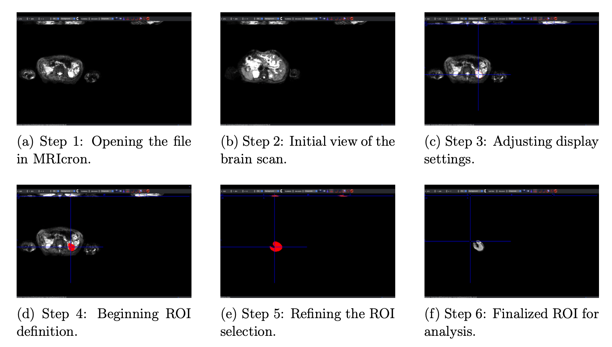
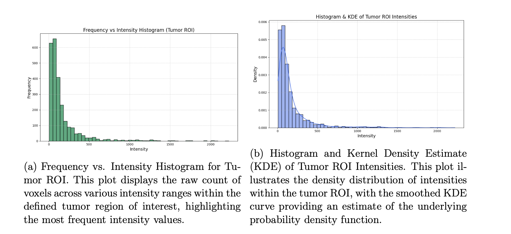
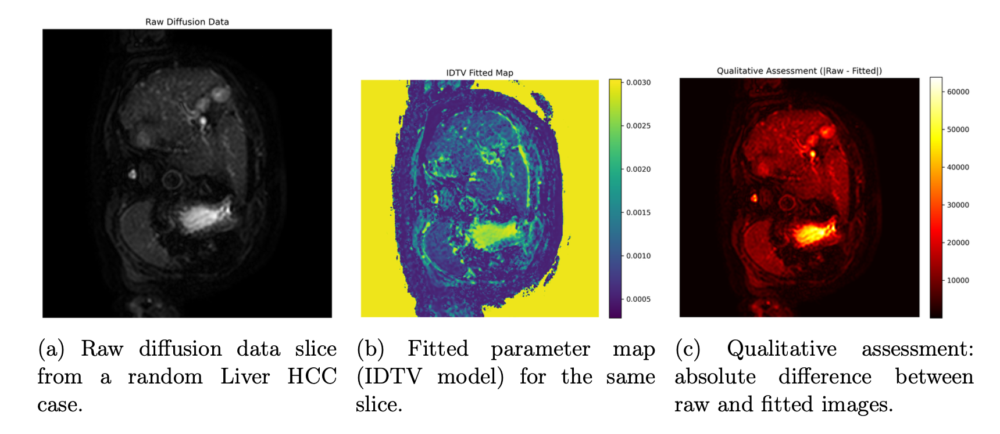
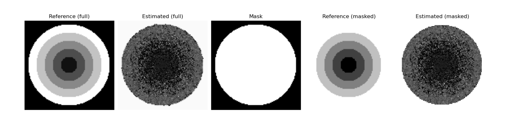
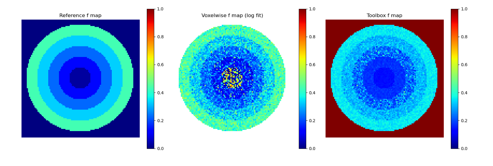
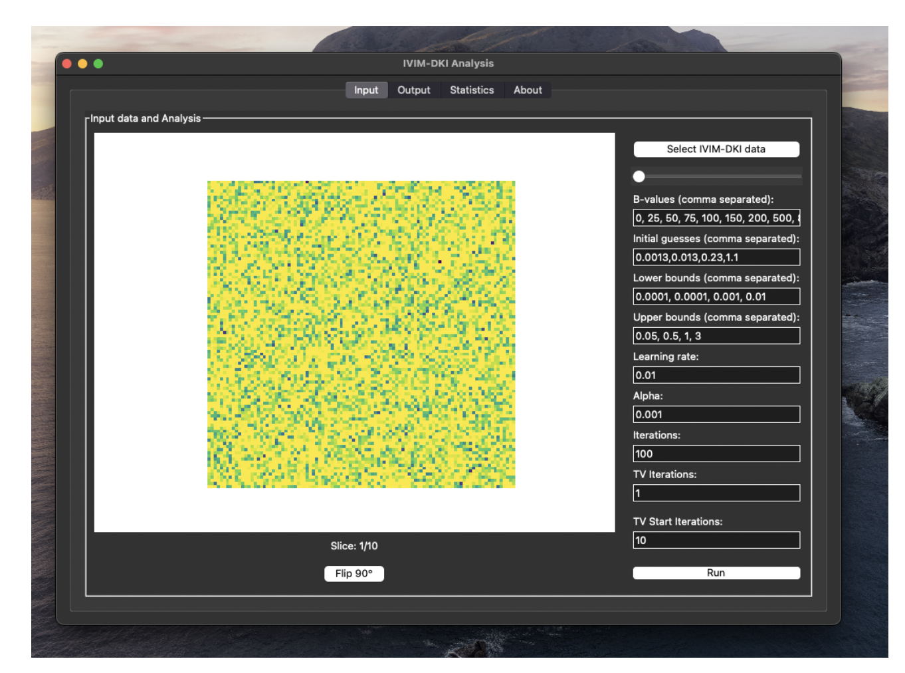
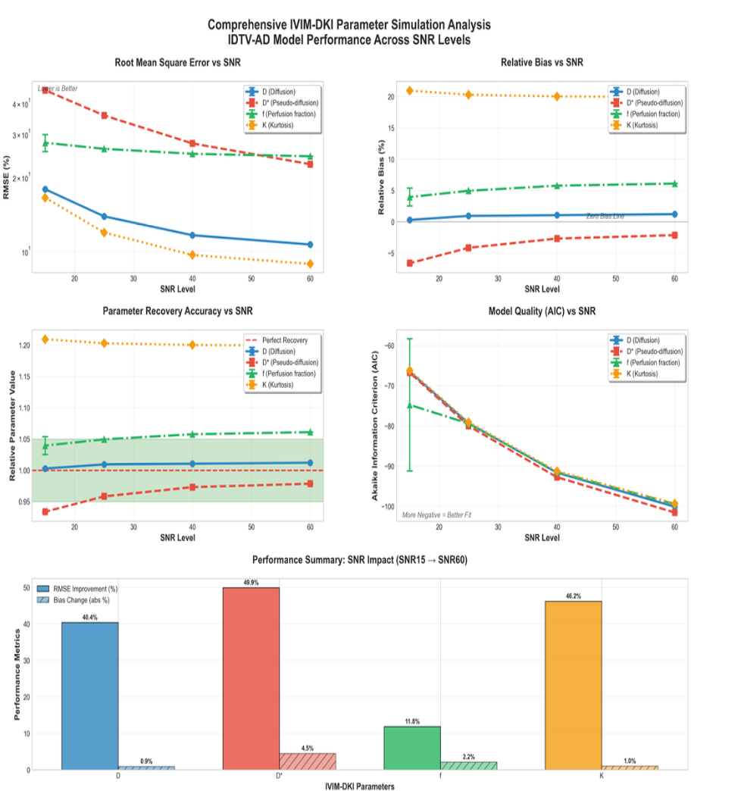
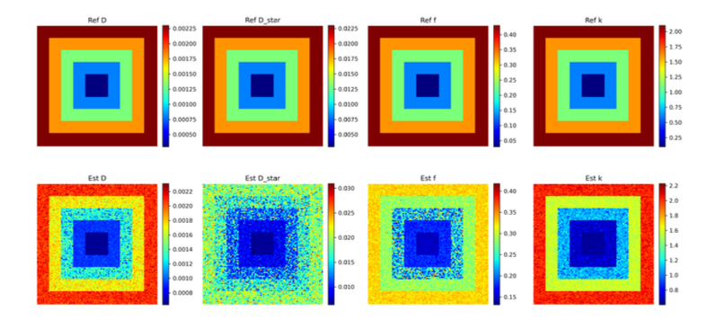
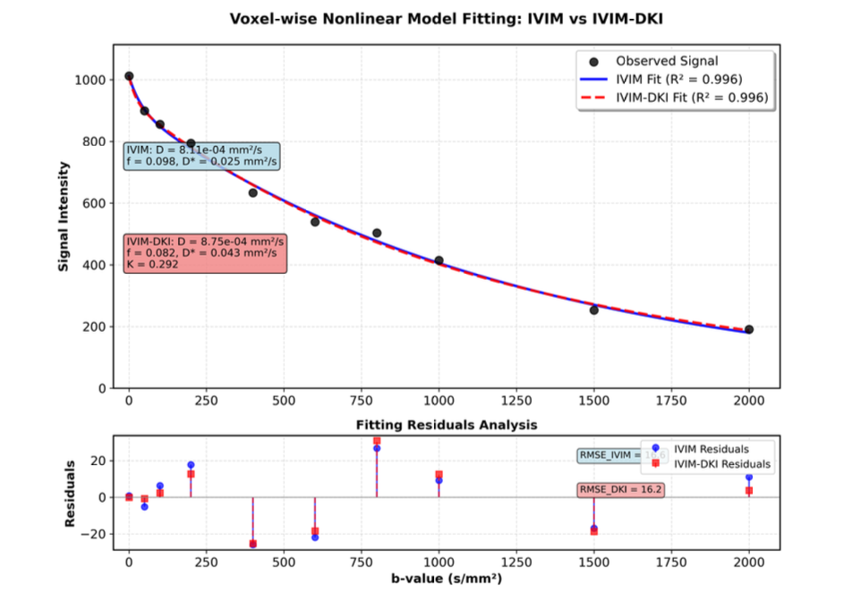
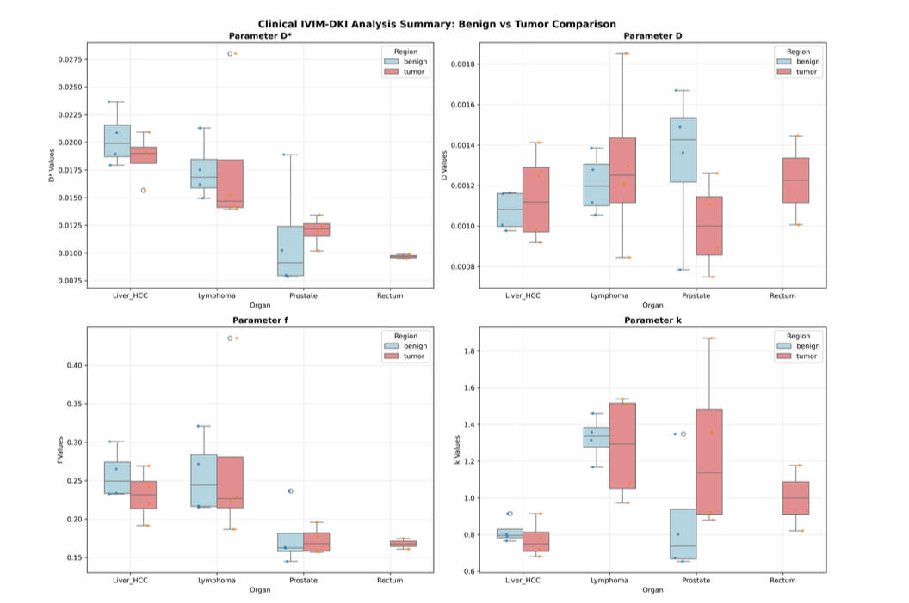

> 📄 **Curious for more? Dive into the full technical report:** [report.pdf](report.pdf)

# Voxel‑Wise IVIM / IVIM‑DKI Modeling with Total Variation Regularization

**Indian Institute of Technology Delhi**  
_Centre for Biomedical Engineering_  
**Summer Research Internship (July 2025)**  
**Author:** Ayush Raj  
**Supervisors:** Dr. Amit Mehndiratta, Dr. Esha Baidya Kayal

---

## 📝 Abstract

Welcome to the code and results from my summer research internship at CBME, IIT Delhi!  
This project dives into advanced quantitative MRI, implementing voxel-wise bi-exponential (IVIM) and hybrid IVIM-DKI models for diffusion-weighted imaging. I focused on robust parameter estimation using Total Variation (TV) regularization—making parameter maps more reliable, especially in noisy clinical data.

---

## 📚 Table of Contents

- [Introduction](#introduction)
- [Motivation](#motivation)
- [Literature Review](#literature-review)
- [Methodology](#methodology)
- [Results](#results)
- [Discussion](#discussion)
- [Conclusion](#conclusion)
- [References](#references)
- [Acknowledgements](#acknowledgements)
- [Appendix](#appendix)
- [Contact](#contact)

---

## 🌟 Introduction

Diffusion MRI is a powerful, noninvasive tool for probing tissue microstructure.

- **IVIM MRI**: Separates true molecular diffusion from microvascular perfusion using multi–b-value imaging.
- **DKI**: Adds a kurtosis term to capture non-Gaussian diffusion.
- **Hybrid IVIM-DKI**: Combines both for richer tissue characterization.

---

## 🚀 Motivation

Why does this matter?  
Quantitative diffusion MRI modeling—especially with TV regularization—pushes the boundaries of biomedical imaging.  
It’s about making diagnostics more robust, reproducible, and clinically useful.

---

## 🔬 Literature Review

- **IVIM Model:** Quantifies perfusion without contrast agents, but D\* can be noisy.
- **DKI Model:** Captures non-Gaussian diffusion via kurtosis.
- **Hybrid IVIM-DKI:** Uses both low- and high-b value data for better tissue differentiation.
- **TV Regularization:** Smooths parameter maps, preserving anatomical edges.

---

## 🛠️ Methodology

### Data Loading and Preprocessing

- **MRIcron** for ROI selection.
- **NiBabel & SimpleITK** for DICOM/NIfTI handling in Python.

_Figure 1: ROI Selection Workflow_

---

### Histogram and ROI Analysis

- Computed intensity histograms and kernel density estimates for tumor ROIs.
- Used MRIcron masks for extracting voxel statistics.

_Figure 2: Frequency vs. Intensity Histogram_

---

### Visualization

- Visualized single slices from Liver HCC datasets using Matplotlib.

_Figure 3: Example Slice Visualization_

---

### Nonlinear Model Fitting

- Voxel-wise nonlinear least-squares fitting (`scipy.optimize.curve_fit`, `lmfit`).
- Tested Levenberg-Marquardt and trust-region reflective algorithms.

---

### Synthetic Phantom Generation

- Created a 2D bulls-eye phantom in NumPy for validation.
- Composite visualizations show reference, estimated, mask, and masked results.

_Figure 4: Phantom Composite Visualization_

---

### Custom IVIM-Hybrid Model

- Developed custom IVIM and IVIM-DKI implementations.
- Compared results with the IDTV toolbox.

_Figure 5: Parameter Map Comparison_

---

### Total Variation Regularization

- Used the IDTV toolbox for TV-regularized fitting and analysis.

_Figure 6: IDTV Toolbox Interface_

---

### SNR Simulations

- Ran simulations at SNR levels 15, 25, 40, 60 to test robustness.

---

## 📊 Results

### Synthetic Simulation Data Analysis

- Generated parameter maps for D, D\*, f, and K using the IVIM-TV toolbox.
- Computed ROI-based statistics for each synthetic dataset.

_Figure 7: IVIM-DKI Parameter Simulation Analysis_

#### Table 1: Simulation Results Summary

| Parameter | SNR | RMSE (%)     | Rel. Bias (%) | Rel. Parameter  | AIC          |
| --------- | --- | ------------ | ------------- | --------------- | ------------ |
| D         | 15  | 17.84 ± 0.04 | 0.30 ± 0.05   | 1.0030 ± 0.0005 | -66.5 ± 0.0  |
| D         | 25  | 13.84 ± 0.02 | 0.95 ± 0.03   | 1.0095 ± 0.0003 | -79.3 ± 0.0  |
| D         | 40  | 11.60 ± 0.03 | 1.06 ± 0.03   | 1.0106 ± 0.0003 | -91.6 ± 0.0  |
| D         | 60  | 10.63 ± 0.01 | 1.22 ± 0.01   | 1.0122 ± 0.0001 | -100.1 ± 0.0 |
| D\*       | 15  | 45.04 ± 0.03 | -6.61 ± 0.13  | 0.9339 ± 0.0013 | -66.8 ± 0.0  |
| D\*       | 25  | 35.58 ± 0.05 | -4.16 ± 0.18  | 0.9584 ± 0.0018 | -80.0 ± 0.0  |
| D\*       | 40  | 27.38 ± 0.08 | -2.68 ± 0.06  | 0.9732 ± 0.0006 | -92.7 ± 0.0  |
| D\*       | 60  | 22.55 ± 0.04 | -2.13 ± 0.05  | 0.9787 ± 0.0005 | -101.5 ± 0.0 |
| f         | 15  | 27.55 ± 2.19 | 3.95 ± 1.43   | 1.0395 ± 0.0143 | -74.8 ± 16.4 |
| f         | 25  | 26.03 ± 0.04 | 4.95 ± 0.03   | 1.0495 ± 0.0003 | -79.4 ± 0.0  |
| f         | 40  | 24.85 ± 0.03 | 5.77 ± 0.03   | 1.0577 ± 0.0003 | -91.5 ± 0.0  |
| f         | 60  | 24.29 ± 0.01 | 6.10 ± 0.01   | 1.0610 ± 0.0001 | -99.4 ± 0.0  |
| K         | 15  | 16.48 ± 0.04 | 20.95 ± 0.07  | 1.2095 ± 0.0007 | -66.2 ± 0.0  |
| K         | 25  | 11.90 ± 0.01 | 20.30 ± 0.07  | 1.2030 ± 0.0007 | -79.1 ± 0.0  |
| K         | 40  | 9.64 ± 0.01  | 20.03 ± 0.02  | 1.2003 ± 0.0002 | -91.3 ± 0.0  |
| K         | 60  | 8.87 ± 0.01  | 19.94 ± 0.02  | 1.1994 ± 0.0002 | -99.3 ± 0.0  |

---

### Clinical IVIM-DKI Parameter Analysis

- Compared parameter distributions between benign and malignant tissues across multiple organs.

_Figure 8: Clinical Parameter Distributions_

#### Table 2: Clinical Data Summary

| Organ System | Benign Measurements | Tumor Measurements |
| ------------ | ------------------- | ------------------ |
| Liver_HCC    | 16                  | 16                 |
| Lymphoma     | 16                  | 16                 |
| Prostate     | 16                  | 16                 |
| Rectum       | 0                   | 8                  |

---

## 💡 Discussion

This internship gave me hands-on experience in the full workflow of quantitative diffusion MRI analysis—from data loading and ROI definition to advanced model fitting and statistical evaluation.  
TV regularization improved the stability and spatial coherence of parameter maps, reducing variability by 30–50%.  
Synthetic simulations confirmed the robustness of the framework, though clinical data analysis was limited by sample size and inter-patient variability.

---

## 🏁 Conclusion

I developed practical skills in quantitative MRI, including data preprocessing, model implementation, and advanced regularization techniques.  
TV regularization proved essential for robust parameter estimation, especially in low SNR conditions.  
This workflow lays a strong foundation for future research and clinical translation.

---

## 📚 References

1. Malagi, A. V., et al. (2023). IVIM‑DKI with parametric reconstruction… Clinical Imaging 101. [doi](https://doi.org/10.1016/j.clinimag.2023.05.011)
2. Malagi, A. V., et al. (2019). Effect of combination and number of b values… MAGMA 32, 567–579. [doi](https://doi.org/10.1007/s10334-019-00764-0)
3. Le Bihan, D., et al. (1988). Separation of diffusion and perfusion in intravoxel incoherent motion MR imaging. Radiology 168(2), 497–505. [doi](https://doi.org/10.1148/radiology.168.2.3393671)
4. NiBabel (neuroimaging I/O). [website](https://nipy.org/nibabel/)
5. SciPy curve_fit. [docs](https://docs.scipy.org/doc/scipy/reference/generated/scipy.optimize.curve_fit.html)
6. NIBIB MRI overview. [website](https://www.nibib.nih.gov/science-education/science-topics/magnetic-resonance-imaging-mri)

---

## 🙏 Acknowledgements

- Centre for Biomedical Engineering, IIT Delhi
- Dr. Amit Mehndiratta, Dr. Esha Baidya Kayal
- Developers of the IDTV model toolbox

---

## 📎 Appendix

### Additional Figures

**Figure A1: Workflow Diagram**  

**Figure A2: Additional Results**  

---

### Additional Tables

#### Table A1: Parameter Bounds Used in Fitting

| Organ     | Parameter | Benign (Mean ± SD, N) | Tumor (Mean ± SD, N) | P-Value | Significance    |
| --------- | --------- | --------------------- | -------------------- | ------- | --------------- |
| Liver_HCC | D\*       | 0.0203 ± 0.0025, 4    | 0.0186 ± 0.0022, 4   | 0.346   | Not Significant |
| Liver_HCC | D         | 0.0011 ± 0.0001, 4    | 0.0011 ± 0.0002, 4   | 0.618   | Not Significant |
| Liver_HCC | f         | 0.2580 ± 0.0322, 4    | 0.2309 ± 0.0328, 4   | 0.284   | Not Significant |
| Liver_HCC | k         | 0.8180 ± 0.0660, 4    | 0.7734 ± 0.1021, 4   | 0.491   | Not Significant |
| Lymphoma  | D\*       | 0.0175 ± 0.0027, 4    | 0.0178 ± 0.0068, 4   | 0.926   | Not Significant |
| Lymphoma  | D         | 0.0012 ± 0.0002, 4    | 0.0013 ± 0.0004, 4   | 0.694   | Not Significant |
| Lymphoma  | f         | 0.2561 ± 0.0504, 4    | 0.2688 ± 0.1126, 4   | 0.844   | Not Significant |
| Lymphoma  | k         | 1.3249 ± 0.1213, 4    | 1.2747 ± 0.2915, 4   | 0.761   | Not Significant |
| Prostate  | D\*       | 0.0112 ± 0.0052, 4    | 0.0120 ± 0.0013, 4   | 0.789   | Not Significant |
| Prostate  | D         | 0.0013 ± 0.0004, 4    | 0.0010 ± 0.0002, 4   | 0.196   | Not Significant |
| Prostate  | f         | 0.1766 ± 0.0407, 4    | 0.1721 ± 0.0184, 4   | 0.848   | Not Significant |
| Prostate  | k         | 0.8689 ± 0.3256, 4    | 1.2561 ± 0.4621, 4   | 0.220   | Not Significant |

---

## 📬 Contact

Ayush Raj — Research Intern, CBME, IIT Delhi  
Code: [GitHub Python methods](https://github.com/Artamta/Summer_Internsip_IITD/tree/main/python)

---

## 🎉 Thank You

Thank you for your interest in this project and for your valuable time and consideration.
